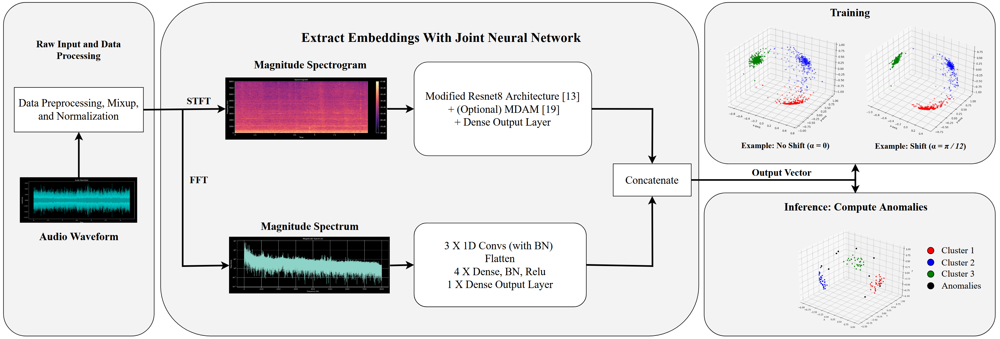

# ACLASMA: Amplifying Cosine Losses for Anomalous Sound Monitoring in Automation

<figure>
  
  <figcaption> We use a slightly modified Wilkinghoff [13] backbone. The hybrid model transforms the audio into a single
    representative embedding vector then feeds it through a cosine loss during training. Our approach aims to boost such losses. 
    The Toy Examples (top right) illustrate the difference between training with and without a Cosine Shift. The Shift reduces the clutter and improves
    the example embedding. Intuitively, anomalies within a trained space will reside as isolated points relatively distant from
    clusters of normal sound samples. This can be used to formulate anomaly scores. </figcaption>
</figure>

## To Run The Code
1. Clone the repository
2. Download and Prepare the DCASE 2022/2023 Datasets by running the data preparation scripts in their respective folders.
3. Specify you desired training settings in the config file.
4. python3 train.py (See a few examples in the Extra folder.

If training is going right, the Warp Loss should slightly bound the Default Loss from above.

## ToDo:
ADD DEPENDANCY LIST. Upload Docker Container. Update README. Link to paper.

## 
Credit to Kevin Wilkinghoff's repository from which we reuse some of the code:
https://github.com/wilkinghoff/icassp2023
